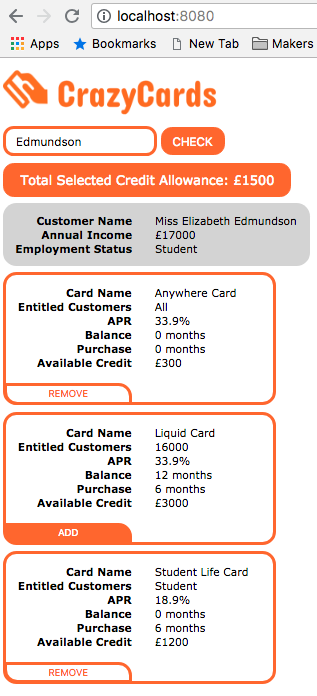

# TM React app

## Instruction
- git clone the project repo
- ```yarn install``` to install all dependencies
- run ```node server.js``` to kickstart server
- ```yarn start``` to kickstart FE application
- ```localhost:8080``` to see application

## Steps completed
- created a number of endpoints to serve **data.json** from data folder on **Express.js**
- used functional and class React components
- used **create-react-app** to scaffold application
- used **axios** to fetch data from endpoint
- Redux for getting customer data, dispatch action creator **GET_CUSTOMER** and flow through **reducer_customer.js** reducer
- added **redux-promise** middleware
- direct use of **axios** and mounting it with lifecycle method **componentDidMount()**
- used **SASS** compiled to **CSS** via ```gulp sass```

## To do
- to include ```node server.js``` and ```localhost:8080``` to run with single command ```yarn start```
- add responsivness
- add some tests, app was not TDD
- FIX: gulpfile to run ```gulp default``` a seqence of watcher, sass, browserSync? 
- BUG: clearing results when name doesn't match ones in data.json
- BUG: selecting card with Rieck and changing to Edmundson keeps 'Anywhere Card' selected (shared by both customers), app should reset state after each Last Name submission
- refactoring needed to REDUX state management, passing state two level deep is prone to errors, may be acceptable for immediate parent/child components
 
## Requested elements in the final output
- Testing
- Extensibility
- Responsive web design
- Hand-rolled server configuration
- Mock endpoints

## Screenshot

